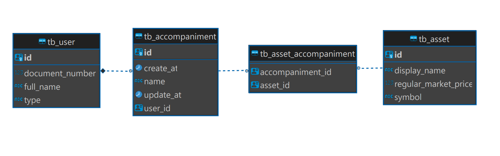

# idealctvm-backend-challenge-mid-level - asset-trackig service

Projeto para vaga de desenvolvedor backend na Ideal CTVM.

## API

Spring boot 3.0.2
Gradle 7.6
Kotlin 1.7.22

## Banco de Dados

PostgresSQL JPA com hibernate

## Execução
### Executação banco de dados postgres: 
#### no diretorio da imagem yml (\asset-tracking\database-docker) executar o comando:
* `docker compose up` no terminal

### Execução api spring boot: 
#### no diretorio do projeto (\asset-tracking) executar os comandos:
* `.\gradlew clean build` - limpar build do projeto
* `docker build -t asset-tracking-app .` - build da imagem
* `docker run -p 8080:8080 asset-tracking-app` - rodar container na porta 8080

## APIs REST
* swagger: http://localhost:8080/swagger-ui/index.html#/
### Criação de Usuário - api cria usuário e adicionar uma lista de acompanhamento vazia.
`curl --location --request POST 'localhost:8080/v1/user' \
--header 'Content-Type: application/json' \
--data-raw '{
"fullName" : "João Silva",
"documentNumber" : "22400527083"
}'`

### Adição de Ativo - usuário adiciona um ativo em sua lista de acompanhamento.
`curl --location --request POST 'localhost:8080/v1/asset' \
--header 'Content-Type: application/json' \
--data-raw '{
"documentNumber" : "86932203065",
"symbol": "GOGL"
}'`

### Consulta lista de ativos adicionados - usuário consulta sua lista de acompanhamento ordenada pelas informações do ativo (nome, codigo, preço)
`curl --location --request GET 'localhost:8080/v1/accompaniment/22400527083/ASSET_PRICE'`
* ASSET_NAME - nome do ativo
* ASSET_SYMBOL - codigo do ativo
* ASSET_PRICE - preço do ativo

### Consulta cotação de ativo - usuário consulta a cotação de um ou mais ativos.
`curl --location --request GET 'localhost:8080/v1/asset/asset-list' \
--header 'Content-Type: application/json' \
--data-raw '{
"assetList":[
"PBR",
"APPL",
"GOGL"
]
}'`

