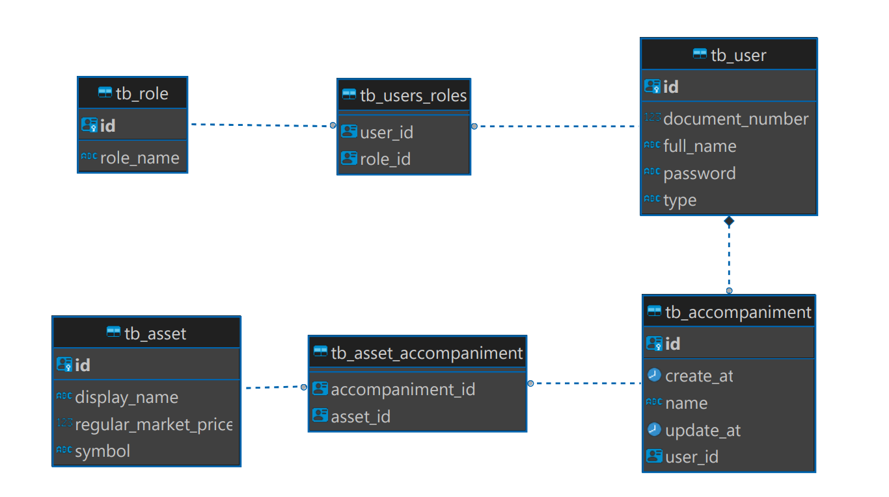

# idealctvm-backend-challenge-mid-level - asset-trackig service

Projeto para vaga de desenvolvedor backend na Ideal CTVM.

## API

Spring boot 3.0.2
Gradle 7.6
Kotlin 1.7.22

## Banco de Dados

PostgresSQL JPA com hibernate

## Execução
### Execução api e banco de dados postgres:
#### no diretório principal executar os comandos no terminal:
* `.\gradlew clean build` - limpar build do projeto
* `docker rmi postgres` - apagar imagem antiga do banco
* `docker rmi asset-tracking-app` - apagar imagem antiga da api
* `docker compose up -d` - montar imagens

## Autenticação Spring Security
#### API implementada com autenticação basic em todas as enpoints necessitando autenticação exceto:
* Cadastro de usuários: POST /v1/user
* swagger: http://localhost:8080/swagger-ui/index.html#/ login: cpf e senha cadastrada

## APIs REST
### Criação de Usuário - api cria usuário e adicionar uma lista de acompanhamento vazia.
`curl --location --request POST 'localhost:8080/v1/user' \
--header 'Content-Type: application/json' \
--data-raw '{
"fullName" : "João Silva",
"documentNumber" : "22400527083"
}'`

### Adição de Ativo - usuário adiciona um ativo em sua lista de acompanhamento.
`curl --location --request POST 'localhost:8080/v1/asset' \
--header 'Content-Type: application/json' \
--data-raw '{
"documentNumber" : "86932203065",
"symbol": "GOGL"
}'`

### Consulta lista de ativos adicionados - usuário consulta sua lista de acompanhamento ordenada pelas informações do ativo (nome, código, preço)
`curl --location --request GET 'localhost:8080/v1/accompaniment/22400527083/ASSET_PRICE'`
* ASSET_NAME - nome do ativo
* ASSET_SYMBOL - código do ativo
* ASSET_PRICE - preço do ativo

### Consulta cotação de ativo - usuário consulta a cotação de um ou mais ativos.
`curl --location --request GET 'localhost:8080/v1/asset/asset-list' \
--header 'Content-Type: application/json' \
--data-raw '{
"assetList":[
"PBR",
"APPL",
"GOGL"
]
}'`

## APIs GraphQl
### Criação de Usuário - api cria usuário e adicionar uma lista de acompanhamento vazia.
`curl --location 'localhost:8080/graphql' \
--header 'Content-Type: application/json' \
--data '{"query":"mutation{\r\n  createUser(user : {\r\n    fullName: \"João\",\r\n  \tdocumentNumber: \"12345678910\",\r\n  \tpassword: \"123\",\r\n  \troles : ROLE_ADMIN\r\n  }\r\n  ){\r\n    id\r\n  \tfullName\r\n  \tdocumentNumber\r\n  }\r\n}","variables":{}}'`

### Adição de Ativo - usuário adiciona um ativo em sua lista de acompanhamento.
`curl --location 'localhost:8080/graphql' \
--header 'Content-Type: application/json' \
--data '{"query":"mutation{\r\n  addAssetAccompaniment(asset : {\r\n  \tdocumentNumber: \"12345678910\",\r\n  \tsymbol: \"APPL\",\r\n  }\r\n  ){\r\n    id\r\n  \tsymbol\r\n  \tdisplayName\r\n    regularMarketPrice\r\n  }\r\n}","variables":{}}'`

### Consulta lista de ativos adicionados - usuário consulta sua lista de acompanhamento ordenada pelas informações do ativo (nome, código, preço)
`curl --location 'localhost:8080/graphql' \
--header 'Content-Type: application/json' \
--data '{"query":"query{\r\n    getAssetAccompaniment(\r\n        documentNumber : \"12345678910\"\r\n        assetOrder : ASSET_NAME\r\n    ){\r\n        name\r\n        createAt\r\n        updateAt\r\n        assetList {\r\n            displayName\r\n            symbol\r\n            regularMarketPrice\r\n        }\r\n    }\r\n}","variables":{}}'`
* ASSET_NAME - nome do ativo
* ASSET_SYMBOL - código do ativo
* ASSET_PRICE - preço do ativo

### Consulta cotação de ativo - usuário consulta a cotação de um ou mais ativos.
`curl --location 'localhost:8080/graphql' \
--header 'Content-Type: application/json' \
--data '{"query":"query{\r\n    getAssetListQuotation(assetList: {\r\n        assetList : [\r\n            \"PBR\", \"APPL\", \"GOGL\"\r\n        ]\r\n    }){\r\n        name\r\n        price\r\n        symbol\r\n    }\r\n}","variables":{}}'`
